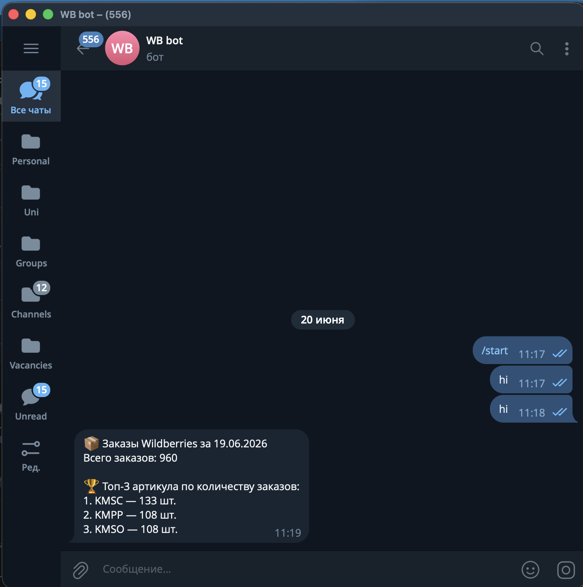

# wb-order-reporter

## Как запустить

```bash
pip install -r requirements.txt
cp .env.example .env
python main.py
```

**Переменные окружения:**

| Переменная | Описание |
|---|---|
| `WB_API_TOKEN` | Токен статистики Wildberries |
| `TELEGRAM_BOT_TOKEN` | Токен бота от @BotFather |
| `TELEGRAM_CHAT_ID` | ID чата |

## Скриншот сообщения в Telegram



## Хранилище

Выбрала SQLite. Google Sheets тормозит после 50к+ строк и упирается в лимиты ячеек. SQLite не требует сервера, держит любой объём, pandas читает его нативно, а для AI инструментов достаточно выгрузить нужные строки SQL-запросом и передать в контекст. Для продакшна мигрировала бы на Supabase — PostgreSQL с REST API, который интегрируется с AI пайплайнами без промежуточных шагов.

## Что доделала бы для продакшна

- Планировщик (cron / APScheduler) для автозапуска каждое утро
- Миграция на Supabase для конкурентных записей и AI интеграции через REST API
- Асинхронная очередь для Telegram уведомлений чтобы сбой отправки не ронял пайплайн данных
- Алертинг при падении скрипта — фолбэк на email или резервный канал
